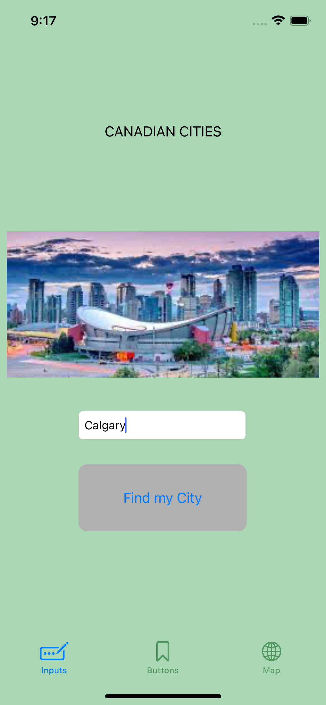
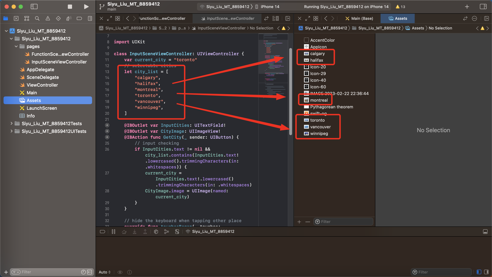
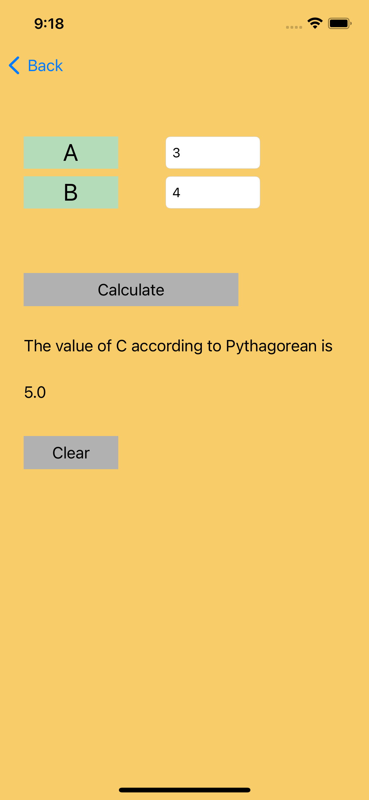
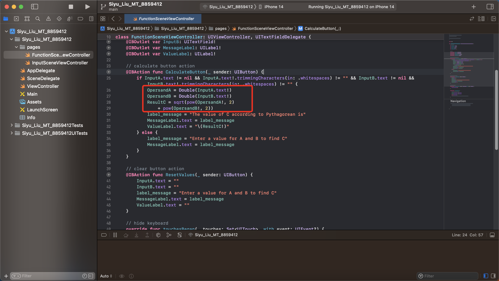

# PROG8470-IOS-Midterm-Mult-Storyboards

The midterm exam project of PROG8470 IOS development of Conestoga College. This app consists of navigation bar and bottom tab bar, can navigate to different storyboards.

## Insert city name to match image

Prepare the image of cities with the same name firsty. If the name is same as those in the list, the imageView will update.

## Triangle Function Calculator

code

